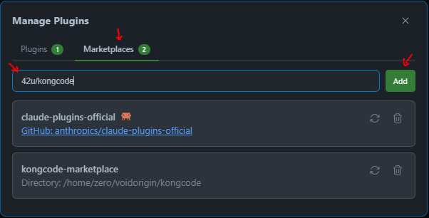
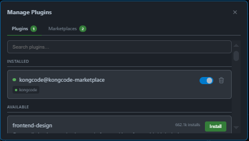

<div align="center">

# LaqrumCode


[](https://voidorigin.com)

[](https://github.com/42U/laqrumcode)
[](https://github.com/42U/laqrumcode)
[](https://opensource.org/licenses/MIT)
[](https://nodejs.org)
[](https://surrealdb.com)
[](https://vitest.dev)

**Graph-backed permanent memory for [Claude Code](https://claude.ai/claude-code).**

[Quick start](#quick-start) | [Architecture](#architecture) | [Configuration](#configuration) | [Troubleshooting](#troubleshooting) | [Development](#development)

</div>

---

## What it does

LaqrumCode gives Claude Code a persistent, queryable memory that grows with every session. It extracts concepts, causal chains, corrections, preferences, decisions, and skills from conversations automatically — then retrieves them with a multi-stage pipeline (BGE-M3 vectors → learned ACAN scoring → cross-encoder reranking, 98.2% R@5) backed by a SurrealDB graph running locally. After enough sessions, the agent earns an emergent identity (soul graduation) grounded in its actual working history.

| Capability | Stock Claude Code | With LaqrumCode |
|---|---|---|
| **Memory** | File-based, per-project, manual | Graph DB, cross-session, automatic |
| **Context window** | Sliding, lost on `/clear` or session end | Retrieval-augmented from prior turns and concepts |
| **Knowledge extraction** | None | Concepts, causal chains, monologues, corrections, preferences, artifacts, decisions, skills, reflections |
| **Procedural memory** | None | Skills mined from successful workflows, surfaced when preconditions match |
| **Retrieval quality** | None (no memory to retrieve) | Vector search → ACAN reranker → cross-encoder rerank → graph expansion (98.2% R@5 on LongMemEval) |
| **Identity** | Stateless on every turn | Earned soul after a graduation gate (volume + quality thresholds) |

## Quick start

Install the plugin, set up the system prompt, and open a session. The daemon provisions SurrealDB, the embedding model, and everything else on first run.

### Prerequisites

| Tool | When required |
|---|---|
| **git** | Always (Claude Code uses it to clone the marketplace repo) |
| **Node.js >= 18 + npm** | Only for the JS fallback path. Most users on linux-x64/arm64, macOS x64/arm64, win-x64 get the SEA binary and don't need Node. |

Quick installs (only if you need Node + git for the fallback path):

- **macOS**: `brew install node git`
- **Windows (PowerShell, elevated)**: `winget install OpenJS.NodeJS.LTS Git.Git` then **restart your terminal AND Claude Code** so the new PATH is picked up.
- **Linux**: distro package manager (`apt install nodejs npm git`) or [nvm](https://github.com/nvm-sh/nvm).

### 1. Install the plugin

**CLI:**

```
/plugin marketplace add 42U/laqrumcode
/plugin install laqrumcode@laqrumcode-marketplace
```

<details>
<summary><strong>VS Code / Cursor / JetBrains</strong></summary>

The plugin system is shared across CLI and IDE extensions. Open a Claude Code session in your IDE, then:

1. Type `/plugins` and press Enter (shows **Manage Plugins**)
2. Go to the **Marketplaces** tab
3. Type `42u/laqrumcode` in the input field and click **Add**

   

4. Switch to the **Plugins** tab
5. Toggle **laqrumcode@laqrumcode-marketplace** on

   

</details>

### 2. Set up prompts (before launching Claude Code)

LaqrumCode ships two template files that teach Claude how to use the memory graph. **Set both up before your first session.**

```bash
# Find the plugin cache (installed by step 1)
LAQRUMCODE_DIR=$(ls -d ~/.claude/plugins/cache/laqrumcode-marketplace/laqrumcode/* 2>/dev/null | head -1)

# Copy the system prompt (appended every session via CLI flag)
cp "$LAQRUMCODE_DIR/templates/laqrumcode.txt" ~/.laqrumcode-prompt.txt

# Copy the global CLAUDE.md (loaded automatically by Claude Code in every project)
cp "$LAQRUMCODE_DIR/templates/CLAUDE.md" ~/.claude/CLAUDE.md
```

Then add a shell alias so every session uses the system prompt automatically:

**bash:**
```bash
echo 'alias claude="claude --append-system-prompt-file ~/.laqrumcode-prompt.txt"' >> ~/.bashrc
source ~/.bashrc
```

**zsh:**
```bash
echo 'alias claude="claude --append-system-prompt-file ~/.laqrumcode-prompt.txt"' >> ~/.zshrc
source ~/.zshrc
```

> **VS Code / IDE users**: The `--append-system-prompt-file` flag is CLI-only. IDE sessions still get the global `~/.claude/CLAUDE.md` automatically, which covers the core rules. For full prompt coverage, paste the contents of `laqrumcode.txt` into your IDE's system prompt settings.

> **Existing `~/.claude/CLAUDE.md`**: If you already have a global CLAUDE.md, append the laqrumcode template rather than overwriting: `cat "$LAQRUMCODE_DIR/templates/CLAUDE.md" >> ~/.claude/CLAUDE.md`

### 3. First session

```bash
claude
```

On first run the daemon provisions everything it needs (one-time, ~2-3 minutes):

- Downloads the SurrealDB binary for your platform
- Downloads the BGE-M3 GGUF embedding model (~420MB)
- Spawns a managed SurrealDB process at `~/.laqrumcode/data/`

Subsequent sessions start in seconds.

### 4. Migrate existing memory files (one-time)

If you have existing `.md` memory files from Claude Code's built-in memory system (`~/.claude/projects/*/memory/*.md`), migrate them into the graph on your first session:

1. Wait for the laqrumcode healthcheck to be green (the daemon will report status at session start)
2. Ask Claude to ingest the old files:
   > "Ingest all my old memory .md files from `~/.claude/projects/*/memory/` into knowledge gems, then archive the originals."
3. Claude will use `create_knowledge_gems` to import each file, then move the originals to an archive directory
4. A single `MEMORY.md` will be left behind pointing to the graph:

```markdown
# MEMORY POINTS AT LAQRUMCODE

This file-based memory system is deprecated. Memory lives in the laqrumcode
graph database at ~/.laqrumcode/data/ (SurrealDB).

Use laqrumcode MCP tools for memory operations:
- `recall` — search the graph
- `record_finding` — save a decision / preference / correction / fact
- `core_memory` — manage always-loaded directives
- `introspect` — DB health and diagnostics

Do not write new .md files in this directory.
```

After migration, all future memory operations go through the graph — no more scattered `.md` files.

### Updating

```
/plugin marketplace update laqrumcode-marketplace
/plugin update laqrumcode@laqrumcode-marketplace
```

No auto-update. Once you update, the next session picks up the new code automatically. No manual restart needed.

### Bring-your-own-SurrealDB (advanced)

If you already run SurrealDB, set `SURREAL_URL` and the bootstrap skips the managed child:

```bash
export SURREAL_URL="ws://localhost:8000/rpc"
export SURREAL_USER=root
export SURREAL_PASS=root
```

LaqrumCode also auto-detects an existing SurrealDB on `8000`, `8042`, or the managed port at startup.

### Platform support

| Platform | SEA binary | JS fallback (needs Node) |
|---|---|---|
| linux-x64 | yes | yes |
| linux-arm64 | yes | yes |
| macOS-arm64 | yes | yes |
| macOS-x64 | no | yes (Node 18+) |
| win32-x64 | yes | yes |
| Other | no | yes (Node 18+) |

If you hit issues, please file at https://github.com/42U/laqrumcode/issues.

## Architecture

LaqrumCode runs as **two cooperating processes**:

```
                    +--------------------------------------------+
                    |  laqrumcode-daemon (long-lived, 1 per host)  |
                    |  +--------------------------------------+  |
                    |  | SurrealStore (graph DB connection)   |  |
                    |  | EmbeddingService (BGE-M3 in RAM)     |  |
                    |  | ACAN weights + retrain loop          |  |
                    |  | Tool + hook handlers                 |  |
                    |  | Auto-drain scheduler                 |  |
                    |  +--------------------------------------+  |
                    |                       ^                    |
                    |           Unix socket | JSON-RPC 2.0       |
                    |     ~/.laqrumcode-daemon.sock                |
                    +--------------------+-+--------------------+
                                         |
              +--------------------------+-------------------------+
              |                          |                          |
   +----------+----------+    +----------+----------+    +----------+----------+
   |  laqrumcode-mcp #1    |    |  laqrumcode-mcp #2    |    |  headless drainer   |
   |  (Claude Code A)    |    |  (Claude Code B)    |    |  (auto-drain spawn) |
   +---------------------+    +---------------------+    +---------------------+
```

- **laqrumcode-daemon**: Long-lived background process owning the SurrealDB connection, BGE-M3 embedding model, BGE-reranker-v2-m3 cross-encoder, ACAN weights, all tool/hook handlers, and the auto-drain scheduler. Survives plugin updates, MCP restarts, and Claude Code crashes.
- **laqrumcode-mcp**: Thin per-session client. Forwards MCP RPC to the daemon over local IPC. Plugin updates only restart this; the daemon keeps running.

**ACAN** (Attentive Cross-Attention Network) is a learned scoring model that replaces the fixed WMR (Weighted Memory Relevance) heuristic once enough retrieval-outcome data accumulates. It trains on query-memory pairs labeled by actual utilization — whether the retrieved item was referenced, cited, or acted on. Training runs in a worker thread; weights are hot-reloaded across concurrent sessions via a shared JSON file. Before ACAN activates, WMR provides a solid baseline using seven weighted signals: cosine similarity (largest weight), recency, importance, access count, neighbor bonus, proven utility, and reflection boost.

**BGE-reranker-v2-m3** is a cross-encoder that rescores the top candidates pairwise against the query after the initial vector + ACAN pass. The two-stage retrieve-then-rerank pipeline is modeled on the design validated at 98.2% R@5 on LongMemEval in the upstream laqrumclaw project; the eval harness for this number ships separately and is not bundled in this repo.

Multiple Claude Code sessions share one daemon: one BGE-M3 in RAM instead of N copies, one SurrealDB connection pool.

### Lifecycle

- **Spawn**: The first mcp-client to find a missing daemon socket forks one (detached, PID-file-locked so concurrent sessions don't race).
- **Idle reap**: When no clients are attached for 6s (configurable), the daemon exits to free RAM. The next client spawns a fresh one in 1-2s.
- **Supersede on update**: When a newer version connects, the old daemon shuts down after all current sessions close. No active work is interrupted.
- **Auto-drain**: When `pending_work` exceeds threshold, the daemon shells out to `claude --agent laqrumcode:memory-extractor-lite` (default; set `LAQRUMCODE_AUTO_DRAIN_MODEL=opus` for the heavier `memory-extractor` variant) as a headless subprocess.

## Auto-drain & costs

Memory extraction (causal chains, concepts, skills, etc.) needs an LLM. The daemon **shells out to your already-authenticated `claude` CLI** to process the queue. This runs under your existing Claude Code authentication and **counts toward your normal usage**. Each spawn processes roughly 5-15 queued items.

**Cadence** (default tier; constrained-resource tier is 15 min between sweeps — see `src/engine/resource-tier.ts:43,53,63`):
- On daemon startup
- Every 5 minutes while the daemon is alive (15 min on constrained tier)
- Once after each session ends (debounced)

**Cost gating**:
- `LAQRUMCODE_AUTO_DRAIN_THRESHOLD` (default 5): below this queue size, the scheduler is a no-op
- PID-file lock prevents overlapping spawns
- `LAQRUMCODE_AUTO_DRAIN=0` disables the scheduler entirely

To disable: `export LAQRUMCODE_AUTO_DRAIN=0` in your shell config.

## Commands & tools

LaqrumCode exposes **slash commands** (you type) and **MCP tools** (the assistant calls them).

| Slash command | What it does |
|---|---|
| `/recall [query]` | Search past knowledge across concepts, memories, turns, artifacts, and skills |
| `/core-memory [action]` | List, add, update, or deactivate always-loaded directives |
| `/introspect [action]` | Database diagnostics: `status`, `count`, `verify`, `query`, `migrate` |
| `/laqrumcode-status` | One-shot health dashboard (counts, embedding coverage, graduation progress) |

The assistant also has access to MCP tools it calls autonomously: `recall`, `core_memory`, `introspect`, `memory_health`, `record_finding`, `supersede`, `link_hierarchy`, `what_is_missing`, `cluster_scan`, `create_knowledge_gems`, `fetch_pending_work`, `commit_work_results`, `create_skill`, and `get_skill_body`.

## Configuration

All env vars are optional with sensible defaults.

### SurrealDB connection

| Variable | Default | Description |
|----------|---------|-------------|
| `SURREAL_URL` | `ws://localhost:8000/rpc` | SurrealDB WebSocket URL. Bootstrap auto-detects `8000`, `8042`, then the managed port. |
| `SURREAL_USER` | `root` | SurrealDB username |
| `SURREAL_PASS` | `root` | SurrealDB password |
| `SURREAL_NS` | `laqrum` | SurrealDB namespace |
| `SURREAL_DB` | `memory` | SurrealDB database |
| `SURREAL_BIN_PATH` | (auto) | Path to surreal binary; bypasses bootstrap download |

### Cache & data paths

| Variable | Default | Description |
|----------|---------|-------------|
| `LAQRUMCODE_CACHE_DIR` | `~/.laqrumcode/cache` | Where binaries, models, and lock files live |
| `LAQRUMCODE_DATA_DIR` | `~/.laqrumcode/data` | SurrealDB data directory |
| `EMBED_MODEL_PATH` | (auto) | Override path to the BGE-M3 GGUF file |
| `LAQRUMCODE_SURREAL_PORT` | `18765` | Managed SurrealDB child's port |

### Bootstrap & daemon lifecycle

| Variable | Default | Description |
|----------|---------|-------------|
| `LAQRUMCODE_SKIP_BOOTSTRAP` | `0` | Set `1` to skip first-run provisioning entirely |
| `LAQRUMCODE_DAEMON_IDLE_TIMEOUT_MS` | `6000` | Daemon exits after last client disconnects. Set `0` to disable. |
| `LAQRUMCODE_DAEMON_TRANSPORT` | `unix` | Set `tcp` for loopback TCP (Windows) |
| `LAQRUMCODE_NODE_LLAMA_CPP_PATH` | (auto) | Override path to node-llama-cpp install |
| `LAQRUMCODE_LEGACY_MONOLITH` | `0` | Set `1` for pre-0.7.0 single-process mode (emergency rollback) |

### GPU selection (multi-GPU, optional)

By default node-llama-cpp uses **all** available CUDA GPUs. On a multi-GPU box you can pin **only** the laqrumcode daemon to specific GPU(s) — without forcing other CUDA apps onto them (e.g. keep a big GPU free). Strictly opt-in: a **no-op by default**, so single-GPU and CPU-only setups are unaffected.

| Variable | Default | Description |
|----------|---------|-------------|
| `LAQRUMCODE_CUDA_VISIBLE_DEVICES` | (unset) | Pins the daemon's CUDA context to the given device(s). Prefer a GPU **UUID** (`GPU-xxxx…`, from `nvidia-smi -L`) over a numeric index — indices depend on `CUDA_DEVICE_ORDER`. |

Equivalent without env: write the value (one line) to `~/.laqrumcode/cuda-visible-devices` — handy to (re)pin a *running* daemon without relaunching the client. An already-set `CUDA_VISIBLE_DEVICES` is left untouched (operator wins). The daemon also sets `CUDA_DEVICE_ORDER=PCI_BUS_ID` so device indices match `nvidia-smi`. Restart the daemon to apply (`kill` it; the next call respawns it).

### Auto-drain

| Variable | Default | Description |
|----------|---------|-------------|
| `LAQRUMCODE_AUTO_DRAIN` | `1` | Set `0` to disable the auto-drain scheduler |
| `LAQRUMCODE_AUTO_DRAIN_THRESHOLD` | `5` | Min queue size before scheduler spawns an extractor |
| `LAQRUMCODE_AUTO_DRAIN_INTERVAL_MS` | `300000` | Periodic check cadence (5 min) |
| `LAQRUMCODE_CLAUDE_BIN` | (auto) | Explicit path to the `claude` binary |

### Logging

| Variable | Default | Description |
|----------|---------|-------------|
| `LAQRUMCODE_LOG_LEVEL` | `warn` | One of `error`, `warn`, `info`, `debug` |

## How it works

### Every turn

Before each prompt, LaqrumCode runs a multi-stage retrieval pipeline to surface the most relevant prior knowledge:

1. **Vector search** — BGE-M3 embeds the prompt and retrieves candidates by cosine similarity from concepts, memories, turns, artifacts, and skills
2. **WMR/ACAN scoring** — a 7-signal Weighted Memory Relevance score (cosine similarity, recency, importance, access frequency, neighbor bonus, proven utility, reflection boost) is computed per candidate. When enough retrieval-outcome data has accumulated (5000+ labeled pairs), the learned ACAN (Attentive Cross-Attention Network) weights replace the fixed WMR weights automatically
3. **Cross-encoder rerank** — the top candidates are rescored pairwise against the query using a BGE-reranker-v2-m3 cross-encoder (~606 MB GGUF, loaded lazily on first retrieval). The two-stage retrieve-then-rerank design is modeled on the upstream laqrumclaw project, which measured 98.2% R@5 on LongMemEval; the eval harness is not bundled in this repo. Falls back to WMR/ACAN-only when the model isn't available
4. **Graph expansion** — each top-scored node's graph neighbors (broader/narrower/related_to edges, causal chains, skill links) are pulled in
5. **Dedup + budget trim** — duplicates are collapsed and the final set is trimmed to fit the context budget
6. **Format + inject** — results are assembled into `<recalled_memory>` blocks and injected into the conversation

Tool calls and their outcomes are tracked. After the assistant responds, the turn is ingested and trailing work is queued.

### Between sessions
When a session ends, LaqrumCode queues extraction work (concepts, causal chains, skills, etc.). The auto-drain scheduler processes these in the background. A cleanup pass on the next session start handles orphaned sessions (e.g. terminals closed without a clean shutdown).

### Soul graduation
After roughly 15 sessions with sufficient quality signals (reflections, completed causal chains, a healthy concept graph, and accumulated skills), the agent earns a **soul**: an emergent identity document with working style, self-observations, and evidence-grounded values. Once graduated, the soul is loaded into every turn, giving continuity across sessions without retraining.

## Troubleshooting

### "Failed to reconnect to plugin:laqrumcode"

The mcp-client failed to start. Common causes:

- **Node not on PATH** (Windows post-winget install): restart your terminal AND Claude Code
- **Daemon binary corrupted**: `rm -rf ~/.laqrumcode/cache && claude` will re-bootstrap
- **Port conflict**: another process is on 18765. Set `LAQRUMCODE_SURREAL_PORT` to a free port.

Check the daemon log: `tail -100 ~/.laqrumcode/cache/daemon.log`

### Daemon won't recycle to new version

Other sessions or background extractors may still be attached. The daemon waits for ALL clients to disconnect before honoring the supersede flag.

To force-recycle: `kill -TERM $(cat ~/.laqrumcode/cache/daemon.pid)`. The next session will spawn a fresh daemon.

### Auto-drain isn't running

Verify auto-drain is not disabled: `echo $LAQRUMCODE_AUTO_DRAIN` (if it prints "0", that's why).

Check if a lock is held: `cat ~/.laqrumcode/cache/auto-drain.pid`

Check if the claude binary is findable: `which claude`

If the binary isn't on PATH, set `LAQRUMCODE_CLAUDE_BIN=/path/to/claude` and restart Claude Code.

### Pending_work queue keeps growing

Each session end queues a few work items. If the queue is growing faster than draining:

- Check daemon log: `grep auto-drain ~/.laqrumcode/cache/daemon.log`
- Lower the threshold: `LAQRUMCODE_AUTO_DRAIN_THRESHOLD=1`
- Manually trigger a drain via `/laqrumcode-status` or by spawning a `laqrumcode:memory-extractor` subagent

### Files & paths to know

| Path | Purpose |
|------|---------|
| `~/.laqrumcode/cache/daemon.pid` | PID of the running daemon |
| `~/.laqrumcode/cache/daemon.log` | Daemon stdout/stderr |
| `~/.laqrumcode/cache/daemon.spawn.lock` | Held during daemon spawn |
| `~/.laqrumcode/cache/auto-drain.pid` | Held while a headless extractor is running |
| `~/.laqrumcode/cache/surreal.pid` | Managed SurrealDB child's PID |
| `~/.laqrumcode-daemon.sock` | Daemon's IPC listening socket |
| `~/.laqrumcode/data/` | SurrealDB data files |
| `~/.laqrumcode/cache/models/` | Downloaded GGUF embedding model |

## Skill suite

LaqrumCode ships skills that auto-activate on matching user prompts. Each lives in `skills/<name>/SKILL.md`.

**Foundation:**
- `laqrumcode-health`: Pre-flight check before graph writes
- `ground-on-memory`: Enforce grounding discipline (scan context, cite items, note gaps)

**Intelligence:**
- `recall-explain`: Cluster recall output, flag contradictions, produce evidence summaries
- `capture-insight`: Foreground knowledge capture without waiting for the batch daemon

**Write-time quality:**
- `supersede-stale`: Realtime supersession of outdated concepts
- `extract-knowledge`: Source-agnostic extraction (PDF, code, URL, doc, transcript) with cross-source linking

**Compound value:**
- `synthesize-sources`: Multi-source meta-concept generation with cross-link edges
- `knowledge-gap-scan`: Topic coverage analysis before research
- `audit-drift`: Periodic sweep for stale knowledge

**Source-specific extraction:**
- `extract-pdf-gems`: PDF-specific knowledge gem extraction (predecessor to source-agnostic `extract-knowledge`)

**Identity & introspection:**
- `laqrumbrain`: Identity-grounded interaction patterns (search memory, recall, soul management)

**Backup & release:**
- `laqrumcode-backup-native`: Lossless SurrealDB-to-SurrealDB snapshot
- `laqrumcode-backup-jsonl`: JSONL export for ingestion into non-SurrealDB systems (Postgres + pgvector, Neo4j, etc.)
- `laqrumcode-backup-semantic`: Knowledge-core-only transfer to peer agents (concepts/memories/skills, no transcript volume)
- `laqrumcode-release`: End-to-end version-bump workflow across all 6 release surfaces

Full workflow docs: [`docs/WORKFLOWS.md`](docs/WORKFLOWS.md).

## Development

```bash
npm run build
npm run dev
npm run typecheck
npm test
```

The `dist/` directory ships in releases (intentionally not gitignored). Contributors should `npm run build` before testing.

A `pre-push` hook gates pushes on the full vitest suite. The hook is **per-clone** (git's `.git/hooks/` is not tracked in the repo) — install it with `cp scripts/pre-push-hook.sh .git/hooks/pre-push && chmod +x .git/hooks/pre-push` after cloning. The suite includes a **schema-edge integrity guard** that checks every `store.relate()` call against the IN/OUT types declared in `schema.surql`, plus **D1-D4 structural lints** (v0.7.94) that prevent regression of the append-only / backfill-coverage / cosine-identity-guard / no-DELETE-on-content-tables invariants.

---

<div align="center">

MIT License | Built by [42U](https://github.com/42U) | [VoidOrigin](https://voidorigin.com)

</div>
